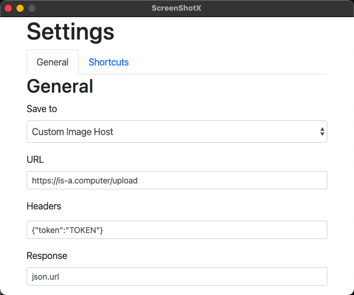
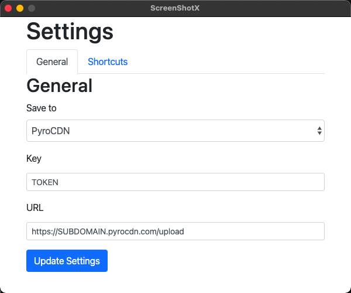
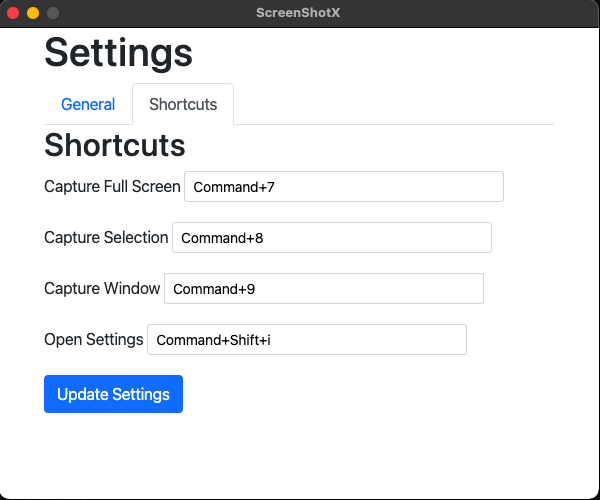
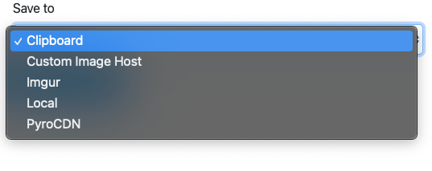

# screenshotx
Default mac screenshot tool uploaded to the cloud

## Features
* Upload to a custom domain with custom headers
* Recieve raw or JSON response 
* PyroCDN and Imgur presets
* Customizable shortcuts

---
### Custom Uploader

**URL:** URL to upload to ex. https://is-a.computer/upload

**Headers:** Custom headers to be sent, should include authentication

**Response:** Image link response ex. response if url is response or json.response
 

---
### [PyroCDN](pyrocdn.com)
**Key:** Key used for authentication

**URL:** URL used to upload to ex. https://img.pyrocdn.com/upload

 

---
## Pictures
 
 